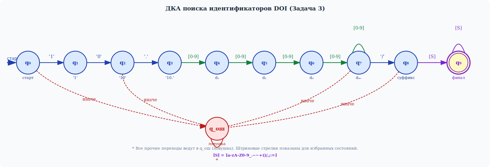

# Лабораторная работа №4: Поиск подстрок с использованием регулярных выражений

## Название работы

**Реализация алгоритма поиска подстрок с помощью регулярных выражений и интеграция в текстовый редактор**

## Цель работы

Изучить теоретические основы регулярных выражений и их применение для поиска и извлечения подстрок из текста.

## Сведения об авторе

- **Студент:** [Гладышев Р.М.]
- **Группа:** [АВТ-314]

## Постановка задачи

Разработать модуль поиска подстрок с использованием регулярных выражений, интегрировать его в существующее приложение (текстовый редактор из лабораторной работы №1) и обеспечить наглядный вывод результатов.

### Вариант задания


| № | Описание задачи |
|---|----------------|
| 1 | Поиск строк, состоящих ровно из **16 цифр** (полис ОМС) |
| 2 | Поиск **имён файлов** с корректным расширением (допустимые расширения: docx, png, cs, txt, md, jpg, cpp, py, exe, pptx) |
| 3 | Поиск **идентификаторов DOI** формата `10.xxxx/...` (где xxxx — 4 и более цифр) |

### Требования к программе

1. Интегрировать модуль поиска в существующий интерфейс текстового редактора (ЛР1).
2. Добавить в интерфейс элементы управления для выбора типа поиска (выпадающий список) и запуска анализа (кнопка «Найти»).
3. Результаты поиска отображать в таблице с колонками.
4. При выборе строки в таблице результатов соответствующая подстрока в области редактирования должна подсвечиваться (изменение цвета фона на жёлтый).
5. Вывод количества найденных совпадений.
6. Обработка пустого текста с выводом сообщения «Нет данных для поиска».

---

## Решение 3 задач (регулярные выражения)

### Задача 1
#### Регулярное выражение
^\d{16}$


| `^` | Начало строки |
| `\d` | Любая цифра (от 0 до 9) |
| `{16}` | Квантификатор — ровно 16 повторений предыдущего элемента (`\d`) |
| `$` | Конец строки |

#### Примеры строк


---

### Задача 2
#### Регулярное выражение
^[a-zA-Zа-яА-Я0-9!@#$%^&()+{};,_.-]{1,255}.(docx|png|cs|txt|md|jpg|cpp|py|exe|pptx)$


| `^` | Начало строки |
| `[a-zA-Zа-яА-Я0-9!@#$%^&()+{};,_.-]` | Набор допустимых символов: латинские буквы (a-z, A-Z), русские буквы (а-я, А-Я), цифры (0-9), и специальные символы |
| `{1,255}` | Квантификатор — от 1 до 255 повторений |
| `\.` | Экранированная точка |
| `(docx\|png\|...\|pptx)` | Группа допустимых расширений через оператор `|` (ИЛИ) |
| `$` | Конец строки |

#### Примеры строк


---

### Задача 3
#### Регулярное выражение
^10\.\d{4,}/[a-zA-Z0-9_.\-~+()/,;:=]+$


| `^` | Начало строки |
| `10` | Литерал `10` |
| `\.` | Экранированная точка |
| `\d{4,}` | 4 и более цифр |
| `\/` | Экранированный слеш (символ `/`) |
| `[a-zA-Z0-9_.\\-~+()\\/,;:=]+` | Один и более символов из допустимого набора (буквы, цифры, подчёркивание, точка, дефис, тильда, плюс, скобки, слеш, запятая, точка с запятой, двоеточие, равно) |
| `$` | Конец строки |

#### Примеры строк


---

## Задача 3 — Реализация через детерминированный конечный автомат (ДКА)

### Описание алгоритма

Поиск идентификаторов DOI (вариант 3) реализован **без использования библиотеки регулярных выражений** — посредством детерминированного конечного автомата (ДКА), вручную построенного по регулярному выражению `^10\.\d{4,}/[a-zA-Z0-9_.\-~+()/,;:=]+$`.

Алгоритм обрабатывает каждую строку текста посимвольно, отслеживая текущее состояние автомата. Строка считается совпадением тогда и только тогда, когда после обработки всех её символов автомат оказывается в **принимающем состоянии q₉**.

---

### Граф ДКА



> **Условные обозначения:**  
> `[0-9]` — любая цифра; `[S]` — символ из множества `[a-zA-Z0-9_.-~+()/,;:=]`;  
> `*` — любой символ; штриховые красные стрелки — переходы в состояние-ловушку q_ош (показаны для части состояний; все прочие непоказанные переходы также ведут в q_ош).

---

### Состояния автомата

| Состояние | Описание |
|-----------|----------|
| **q₀** | Начальное состояние |
| **q₁** | Прочитан символ `'1'` |
| **q₂** | Прочитана подстрока `'10'` |
| **q₃** | Прочитана подстрока `'10.'` |
| **q₄** | Прочитана `'10.'` + 1 цифра |
| **q₅** | Прочитана `'10.'` + 2 цифры |
| **q₆** | Прочитана `'10.'` + 3 цифры |
| **q₇** | Прочитана `'10.'` + **≥ 4 цифр** (петля по `[0-9]`) |
| **q₈** | Прочитан разделитель `'/'` |
| **q₉** | **Принимающее состояние** — прочитан допустимый суффикс (петля по `[S]`) |
| **q_ош** | Состояние-ловушка (все ошибочные переходы) |

---

### Таблица переходов ДКА

| Состояние | `'1'` | `'0'` | `'.'` | `[0-9]` | `'/'` | `[S]\[0-9]` | иначе |
|-----------|-------|-------|-------|---------|-------|-------------|-------|
| q₀ | q₁ | q_ош | q_ош | q_ош | q_ош | q_ош | q_ош |
| q₁ | q_ош | q₂ | q_ош | q_ош | q_ош | q_ош | q_ош |
| q₂ | q_ош | q_ош | q₃ | q_ош | q_ош | q_ош | q_ош |
| q₃ | q_ош | q_ош | q_ош | q₄ | q_ош | q_ош | q_ош |
| q₄ | q_ош | q_ош | q_ош | q₅ | q_ош | q_ош | q_ош |
| q₅ | q_ош | q_ош | q_ош | q₆ | q_ош | q_ош | q_ош |
| q₆ | q_ош | q_ош | q_ош | q₇ | q_ош | q_ош | q_ош |
| q₇ | q_ош | q_ош | q_ош | q₇ | q₈ | q_ош | q_ош |
| q₈ | q₉ | q₉ | q₉ | q₉ | q₉ | q₉ | q_ош |
| **q₉** | q₉ | q₉ | q₉ | q₉ | q₉ | q₉ | q_ош |
| q_ош | q_ош | q_ош | q_ош | q_ош | q_ош | q_ош | q_ош |

> Строка **принята**, если автомат завершает обработку в состоянии **q₉**.  
> В q₈ и q₉ колонка `[0-9]` включена в `[S]`, поэтому переход происходит в q₉ по любому допустимому символу (в т.ч. цифрам).

---

### Тестовые примеры поиска (реализация через автомат)

Тестовый текст, введённый в редактор (8 строк):

```
10.1016/j.cell.2024.01.001
10.1038/nature14539
10.21203/rs.3.rs-123456/v1
10.9999/article.2024
some random text
10.123/too-short
10.1234/
101234/test
```

#### Результаты — таблица найденных совпадений

| # | Найденная подстрока | Позиция (строка, символ) | Длина |
|---|---------------------|--------------------------|-------|
| 1 | `10.1016/j.cell.2024.01.001` | Строка 1, символ 1 | 26 |
| 2 | `10.1038/nature14539` | Строка 2, символ 1 | 19 |
| 3 | `10.21203/rs.3.rs-123456/v1` | Строка 3, символ 1 | 26 |
| 4 | `10.9999/article.2024` | Строка 4, символ 1 | 20 |

**Совпадений: 4**

#### Трассировка автомата для каждого совпадения

**Строка 1:** `10.1016/j.cell.2024.01.001`

```
q₀ →[1]→ q₁ →[0]→ q₂ →[.]→ q₃ →[1]→ q₄ →[0]→ q₅ →[1]→ q₆ →[6]→ q₇
   →[/]→ q₈ →[j]→ q₉ →[.]→ q₉ →[c]→ q₉ ... →[1]→ q₉   ✓ ПРИНЯТО
```

**Строка 2:** `10.1038/nature14539`

```
q₀ →[1]→ q₁ →[0]→ q₂ →[.]→ q₃ →[1]→ q₄ →[0]→ q₅ →[3]→ q₆ →[8]→ q₇
   →[/]→ q₈ →[n]→ q₉ →[a]→ q₉ ... →[9]→ q₉   ✓ ПРИНЯТО
```

**Строка 6:** `10.123/too-short` *(не совпадает)*

```
q₀ →[1]→ q₁ →[0]→ q₂ →[.]→ q₃ →[1]→ q₄ →[2]→ q₅ →[3]→ q₆ →[/]→ q_ош
   (только 3 цифры — недостаточно для q₇, переход '/' из q₆ → q_ош)  ✗ ОТКЛОНЕНО
```

**Строка 7:** `10.1234/` *(не совпадает)*

```
q₀ →[1]→ q₁ →[0]→ q₂ →[.]→ q₃ →[1]→ q₄ →[2]→ q₅ →[3]→ q₆ →[4]→ q₇
   →[/]→ q₈   (строка закончилась в q₈, не q₉)  ✗ ОТКЛОНЕНО
```

**Строка 8:** `101234/test` *(не совпадает)*

```
q₀ →[1]→ q₁ →[0]→ q₂ →[1]→ q_ош   (ожидалась точка '.')  ✗ ОТКЛОНЕНО
```

---

### Фрагмент реализации ДКА (C#)

```csharp
private enum State { q0, q1, q2, q3, q4, q5, q6, q7, q8, q9, Dead }

private static State Transition(State state, char c)
{
    switch (state)
    {
        case State.q0: return c == '1'                              ? State.q1 : State.Dead;
        case State.q1: return c == '0'                              ? State.q2 : State.Dead;
        case State.q2: return c == '.'                              ? State.q3 : State.Dead;
        case State.q3: return (c >= '0' && c <= '9')               ? State.q4 : State.Dead;
        case State.q4: return (c >= '0' && c <= '9')               ? State.q5 : State.Dead;
        case State.q5: return (c >= '0' && c <= '9')               ? State.q6 : State.Dead;
        case State.q6: return (c >= '0' && c <= '9')               ? State.q7 : State.Dead;
        case State.q7:
            if (c >= '0' && c <= '9') return State.q7;
            if (c == '/')             return State.q8;
            return State.Dead;
        case State.q8: return IsAllowedSuffix(c) ? State.q9 : State.Dead;
        case State.q9: return IsAllowedSuffix(c) ? State.q9 : State.Dead;
        default:       return State.Dead;
    }
}
```

Метод `IsAllowedSuffix` проверяет принадлежность символа множеству `[a-zA-Z0-9_.-~+()/,;:=]`:

```csharp
private static bool IsAllowedSuffix(char c)
{
    return (c >= 'a' && c <= 'z') || (c >= 'A' && c <= 'Z') ||
           (c >= '0' && c <= '9') || "_.-~+()/,;:=".IndexOf(c) >= 0;
}
```
